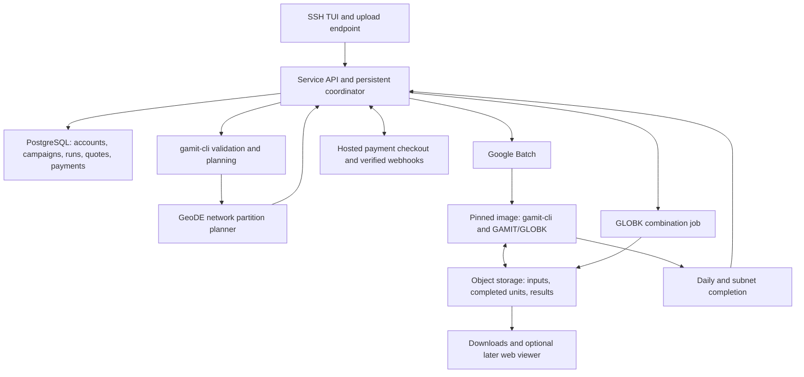

# SSH campaign processing service review

Reviewed 2026-09-13. This dated review preserves the architecture recommendation
and implementation sequence from that date; it is not an implementation or
deployment. Repository findings, prices and service capabilities refer to that
review date, not the current repository or provider state. Repository findings refer to the
local refs below; remote-tracking refs were inspected without fetching or merging.
The ongoing benchmark work was not changed or rerun. Available local conversation
history was searched, but the original service discussion was not recovered in
full. The archived roadmap and migration proposal provide the clearest surviving
record of that design.

The proposed service is feasible. The strongest foundation is the ordinary
campaign TOML workflow, with an SSH application providing access to a durable
service backend. Use GeoDE's network expertise, a pinned GAMIT/GLOBK engine,
Google Batch for initial cloud execution, and object storage for inputs and
results. Start with a complete single-worker campaign, then add subnet scheduling.
The first useful implementation does not require migrating every GeoDE command
away from Dispy.

**What exists today.**

| Repository/ref | Evidence | Consequence for the service |
| --- | --- | --- |
| GeoDE `dev`, `f22595c` | Dispy in `geode/pyJobServer.py`; network partitioning in `geode/network.py`; GAMIT and GLOBK coordination in `com/ParallelGamit.py`; Django/PostgreSQL, reports and archive tools | Substantial scientific and data-management functionality exists, but it is coupled to GeoDE configuration, database state and filesystem layout. |
| GeoDE migration proposal, `2641b0b`, 2026-02-11 | `CeleryMigrationPlan.md` proposes Celery/Redis, pickle task arguments and a compatibility adapter | This is a plan, not the implemented compute backend. The web backend already uses Celery/Redis for its own background work. |
| gamit-cli local `main`, `3501d1e` | `campaign validate/inspect/plan/stage/prepare/run/status`, generated native controls, preparation hashes and checked resume | Suitable worker entry point. Local `main` is 22 commits ahead of the inspected remote-tracking `main`; a build must pin the intended local work. |
| gamit-cli `origin/feature/golden-image`, `b5c29c2`, 2026-07-24 | Packer GCP image, systemd worker, cloud-init template and extended roadmap | Useful infrastructure prototype, not a working processing service. The Celery task raises `NotImplementedError`. |
| gamit-globk `original`, `e629198` | Reconstructed upstream 10.71 plus cached 20260801 updates | Preserved upstream reference. |
| gamit-globk `fix/solve-atmospheric-indexing`, `4a6a42d` | Reviewed atmospheric and station-control corrections with recorded native runs | Corrected unoptimized comparison baseline for the current optimization study. |
| gamit-globk `perf/optimized`, `659307f` | Reviewed vector/INVER2/OpenMP changes plus integrated SOLVE corrections | Candidate production engine, pending applicable campaign and performance results. |
| gamit-globk `perf/globk-level3`, `0b773c4` | GLOBK DGEMM changes, kernel checks and saved-input combination replay | Separate candidate. Daily GAMIT timing alone will not measure its benefit. |
| gamit-bench `main`, `c181202` | Independent study runner, explicit OpenMP/BLAS settings, pinned builds, retained results and comparisons | Correct owner for performance evidence. Benchmark controls should remain outside scientific TOML. |

The engine fork's local `main` is now the unoptimized baseline plus maintenance
documentation; the optimization work is on the named branches. Its local and
remote-tracking `main` refs diverge. A deployment that simply clones remote
`main` would not identify the reviewed engine. The archived wrapper experiment
and `research/deferred-model-policies` are historical investigation material,
not service dependencies.

Useful current entry points are the
[native workflow](https://github.com/silentpills/gamit-cli/blob/3501d1e7e4486ed267c12c4b9c99fe84761bf7de/docs/campaign-native-workflow.md),
[campaign contract direction](https://github.com/silentpills/gamit-cli/blob/3501d1e7e4486ed267c12c4b9c99fe84761bf7de/docs/campaign-contract-direction.md),
[engine maintenance record](https://github.com/silentpills/gamit-globk/blob/4a6a42da9bb17c81382ae593f070560a14d05373/docs/fork-maintenance.md), and
[benchmark pilot report](https://github.com/silentpills/gamit-bench/blob/c18120245301c8b716f9647914d8392f8af3d1db/docs/implementation-validation-20260913.md).

The CLI's campaign TUI currently creates a default campaign, imports from a
`tables` directory, and validates `campaign.toml` in the working directory.
Campaign editing, remote uploads, quotes, payments, run monitoring and result
retrieval are additional UI work. Its local installer/credential-management
screens should not become customer controls for the hosted installation.

GeoDE's `CampaignPlanner` is a field-visit itinerary planner. It does not estimate
processing costs or compile the shared campaign TOML into subnet jobs. GeoDE's
existing campaign database objects likewise need an explicit relationship to
uploaded processing campaigns; sharing the name does not supply that integration.

**The service structure I recommend.**



Use a small Go service for Wish, account/session handling, the API and the cloud
adapter. PostgreSQL stores durable state. A narrow GeoDE Python adapter handles
network planning and later result ingestion. Keep these modules together in a
dedicated service repository initially; they do not need independently deployed
microservices. Existing GeoDE installations and local gamit-cli remain useful
on their own. A future Django integration can use this same service API.

The coffee example is likely [Terminal](https://www.terminal.shop/), which offers
`ssh terminal.shop`. [Charm Wish](https://github.com/charmbracelet/wish) directly
supports Bubble Tea applications over SSH, making the existing Go UI stack a
sensible choice. Select compatible Wish/Bubble Tea versions together; the local
CLI and current upstream examples use different import generations.

Each SSH connection is a view of persisted account and run state. Disconnecting
must leave processing running; reconnecting reconstructs the display. Preserve
server host keys, support account key rotation/recovery, and separate a public
key identity from the payment/account identity. No persistent terminal session
or `tmux` is needed for job durability.

For upload, provide an explicit command such as the proposed
`ssh service.example campaign upload < campaign.toml`, plus SFTP or an HTTPS
upload link for data bundles. A terminal drag-and-drop often pastes a local
filename; it does not transfer the file. Wish's SCP middleware is not evidence
that SFTP support is already implemented. Define and test the chosen protocol.

The TOML remains the one authored scientific declaration. Observation files,
station metadata, products and grids remain separate inputs. Preserve relative
paths in an uploaded directory/bundle, inventory and hash the files, and report
missing inputs before giving a firm quote. Absolute desktop paths need explicit
remapping or a revised declaration. Store authored and effective identities and
record accepted remapping/output overrides. Cloud hardware, prices and payment
state belong in service records, not a second user-authored campaign format.

**Google Batch is the best initial orchestration fit.**

Batch schedules and executes jobs on automatically provisioned Google Cloud
resources. It accepts script or container workloads and has no additional Batch
service charge; compute, disks, storage, networking and logging still cost money.
That covers much of the VM lifecycle this service otherwise needs to implement.
See [Batch](https://docs.cloud.google.com/batch/docs),
[job creation](https://docs.cloud.google.com/batch/docs/create-run-basic-job), and
[pricing](https://cloud.google.com/batch/pricing).

Packer builds the reusable machine image; it does not scale the campaign at run
time. Build an image compatible with Batch, preferably from a supported Batch
base, and validate a real Batch launch. Arbitrary custom images are not all
supported. See [Batch OS environments](https://docs.cloud.google.com/batch/docs/vm-os-environment-overview).

The service should retain its own task graph and reconcile provider jobs with
stored runs. It can submit a combination job after verifying all required unit
receipts. This also avoids requiring Google's currently alpha-command documented
[dependent-job interface](https://docs.cloud.google.com/batch/docs/create-run-dependent-job)
for the initial implementation. Batch state is operational evidence, not the
permanent customer archive.

| Alternative | Assessment |
| --- | --- |
| Celery with Redis | Reasonable for modernizing GeoDE's Python background work. Does not itself provision VMs, define scientific dependencies, preserve outputs or enforce customer budgets. |
| Ray | Useful for distributed Python tasks, actors and cluster autoscaling. Current workloads are largely native processes exchanging files, so its object-store model offers less immediate benefit. It also uses cloudpickle and assumes trusted execution. |
| Direct GCP API and worker fleet | Viable, and present in the old roadmap, but leaves more worker lifecycle, draining, reconciliation and retry management to this project. |
| Slurm on cloud VMs | Fits a future requirement for HPC queue compatibility or tightly coupled jobs. Adds cluster administration to this initial service. |
| Multiple cloud providers | Add a second provider after actual workload prices justify it; keep submission/status/cancel behind an adapter now. |

The surviving proposal names Redis, so it may be the remembered “R.” Ray is
another plausible recollection, but I did not find a committed Ray migration.
[Ray's security model](https://docs.ray.io/en/latest/ray-security/index.html)
also means adopting it would not remove pickle from the underlying machinery.

**Modernize the execution boundary, then the old scheduler.**

GeoDE currently uses Dispy for computation and separately uses pickle to save
interactive ETM stacker sessions. These are different responsibilities. The old
[Celery proposal](https://github.com/silentpills/geode/blob/2641b0bd2ebee61114531a4f1033c4540b60362b/CeleryMigrationPlan.md) explicitly retains pickle and
arbitrary function dispatch. For a service, use named operations with versioned
JSON descriptions: a run/unit identity, immutable input manifest, engine identity,
resource settings and output location. Workers reconstruct their internal objects
or invoke the public CLI. Never deserialize a customer-supplied pickle.

Do not enable pickle on the existing Django app as that proposal suggests; its
current task serializer is JSON. A future ETM session format can separately use
versioned JSON metadata with a typed numerical container when arrays require it.

GeoDE's current worker copies from a shared solution directory to scratch and
replaces the shared result directory on completion or failure. Simply enabling
late acknowledgements around this behavior can produce competing writes after
retries. Use separate attempt directories, durable completed-unit uploads,
checksummed receipts, and a transactional rule selecting one successful result
for each unit. Repeated notifications must not start a second billed run or
publish duplicate scientific results.

With Celery/Redis, the default visibility timeout is one hour. Longer tasks can
be redelivered, and increasing the timeout delays recovery after forceful worker
loss. Broker configuration alone does not provide idempotence. See
[Celery's Redis caveats](https://docs.celeryq.dev/en/stable/getting-started/backends-and-brokers/redis.html).

The worker should download immutable inputs to a local POSIX filesystem and
upload outputs after completion. Do not treat object storage as a drop-in shared
POSIX filesystem for native Fortran and shell tools. Use job-scoped access to
inputs/results, separate scratch per customer, and a read-only engine. Limit
campaign paths and acquisition URLs to authorized data; audit strings reaching
generated shell/native controls. This protects the actual upload boundary without
requiring a general-purpose remote shell service.

**Network decomposition is the central integration task.**

GeoDE already selects active stations by date, partitions with BisectingQMeans,
adds overlap/tie stations and a backbone, and combines outputs with GLOBK. Current
`Network` construction also queries processing state, creates sessions and can
change database records. Extract a planning operation that returns data without
creating production sessions or modifying processing state.

The present code starts partitioning above 50 active stations (`BACKBONE_NET + 5`)
and uses configured cluster size and ties. This is not a general estimate of
`ceil(total_stations / 50)`: station availability changes daily, ties appear in
multiple solves, and a backbone can add a solve. Size limits apply after adding
ties and reference stations. Native compiled dimensions also matter: the reviewed
source has `maxsit=80`, while the pilot's actual build records its own dimensions.
More VM memory does not automatically increase compiled limits.

The new planner should return, per date, the complete station membership of each
solve, overlap/backbone roles, resource requirements, expected outputs and
combination dependencies. Retain a digest of that exact plan with the quote.
Changing the network decomposition can change the scientific result, so freeze
and disclose it; do not silently reduce sampling, change ambiguity settings or
partition differently just to reach a price.

The CLI currently refuses multiple native sessions on one GPST day in one
workspace (`internal/campaign/workflow.go`). Distributed same-day subnet execution
therefore needs a public unit-execution interface, separate workspaces and
receipts, and support for gathering those results into the declared combination.
The scientific translation must continue to be owned by gamit-cli. The service
should not render its own competing GAMIT controls or ask users to author one
campaign file per subnet. A derived execution plan is machine-generated evidence
supporting the single campaign.

For a split campaign the graph is input preparation → daily subnet/backbone
solves → daily combination → requested cross-day/annual/velocity combination →
reports. Daily combination can start as soon as that day's prerequisites finish.
Do not average subnet coordinates as a substitute for the native combination.
Use GeoDE's established strategy as the starting point and test overlap handling,
frame realization, uncertainties and failure behavior against a tractable whole
network. Establish appropriate comparisons; partitioning does not promise exact
equivalence to a monolithic solve.

Continue independent days if one fails, but report incompleteness. A combined
solution must not silently omit a requested day or subnet. Preserve partial
outputs and distinguish completed processing, quality findings and requested
deliverables. Do not make unrelated Galeos capability gaps a dependency here.

**The golden-image branch needs selective reconstruction.**

Retain the Packer/systemd packaging ideas. Port the useful files onto the current
codebase instead of restoring the old YAML campaign/profile model in its roadmap.
The old build installs through the upstream downloader, selects FES2004/CSR4 grids,
and describes a roughly 45-second boot without reviewed deployment evidence.
It does not select the optimized fork. Its worker starts as a stub, optionally
fetches a mutable `worker.py` at boot, and sets concurrency to `nproc`.

The replacement image must pin the native source commit, corrections, compiler,
flags, compiled dimensions, BLAS runtime, CLI version, worker version and relevant
table/grid hashes. Pin image identity for a quoted run; an image-family “latest”
pointer is insufficient for reproduction. Keep campaign-selected products
authoritative. Rebuild and qualify new images before offering them for new runs;
do not update an active installation underneath a campaign. Use a tested target
CPU policy rather than copying host-specific compiled binaries blindly.

Build-time download credentials must not remain in the image. Runtime access
should use narrowly scoped cloud identities and secret delivery, not customer
passwords in a shared template. Replace the worker stub with the real pinned
runner and test failure, cancellation, output retrieval and teardown.

The roadmap's fixed 24-hour Spot limit is incorrect for current Spot VMs. Google
documents no minimum or maximum runtime unless configured, but preemption can
happen at any time. A task interrupted halfway through may need to repeat that
work. Completed-unit retention prevents completed work from repeating; it is not
a native mid-SOLVE checkpoint. See [Spot VMs](https://docs.cloud.google.com/compute/docs/instances/spot).

**Use the benchmarks to choose both threads and machines.**

Three separate quantities matter: independent solve processes per VM, OpenMP
threads per process, and BLAS threads per process. SMT hardware threads are another
variable. `nproc` workers multiplied by multithreaded kernels can oversubscribe
both CPU and memory. Give tasks explicit CPU sets and memory limits, and choose
process/thread combinations from measured throughput and latency. OpenMP/BLAS
may execute in different phases or nest, so a single thread-count multiplication
is not a reliable resource model.

Compare several medium x86 VM sizes in C4/C4D against the older C2/C2D candidates;
include H3/H4D if the workload and availability warrant a whole-host machine.
Current H3/H4D disable SMT and count physical cores as vCPUs, illustrating why raw
vCPU totals are not comparable across families. See Google's
[general-purpose machines](https://docs.cloud.google.com/compute/docs/general-purpose-machines)
and [compute-optimized machines](https://docs.cloud.google.com/compute/docs/compute-optimized-machines).
GCP is a sensible first provider, but there is not yet workload evidence that it
or its largest instance is cheapest for this service.

The retained pilot already contains useful findings: optimized OpenMP 1 / BLAS 2
passed its ten-station RELAX comparison, while OpenMP 2 / BLAS 1 had repeatable
ambiguity identity/bias differences. Coordinate fields remained within that
pilot's limits; this does not explain the ambiguity difference. Artifact-only
grouped velocity comparisons passed. These are engineering pilots, not a
repeated speed study. Preserve the distinction and use only qualified
engine/settings combinations in the offered service profiles. The report does
not justify calling the entire optimized branch either correct or incorrect.

For service calibration, request timings and memory for acquisition/staging,
preparation, daily native execution, combination and export, including cold-cache
and warm-cache cases. Sweep network size, epochs, relevant scientific settings,
process concurrency and independent OpenMP/BLAS pairs. Include actual cloud
hardware and current image builds. `gamit-bench` already records substantial
identity and measurement evidence, but its native timings do not currently
provide SOLVE-only duration. Fine-grained native instrumentation is optional work,
not something the current report can infer.

**Quotes must come from an executable plan.**

First give a provisional estimate from the declared campaign. After staging,
inspect actual files, availability and products, freeze the decomposition and
supported engine profile, and issue the payable quote. Missing data can change
the cost and the scientific run, so changes require a new plan/quote.

Fit per-unit time and memory estimates using station count, epochs, satellites,
estimated parameter counts, ambiguity/orbit/model options and hardware/build
identity. A station-day count is a useful descriptive number, not an adequate
runtime model. Dense operations and combination can scale nonlinearly.

For each candidate execution schedule:

```text
finish time = staging + provisioning + dependency-aware execution + export
compute cost = sum over VMs of (billed runtime × applicable VM rate)
direct cost = compute + disks + storage/operations + networking + logs + retries
customer price = direct-cost policy + service fee + applicable payment/tax amounts
```

Simulate placement on CPU/memory-constrained workers and include startup,
preemption/retry exposure and the serial combination tail. Do not multiply full
campaign wall time by maximum fleet size if those VMs run for different intervals.
Conversely, task CPU seconds alone miss idle provisioned VM time.

Offer an economical option and a faster option when supported by measurements.
Show solve counts, maximum concurrency, expected elapsed-time range, compute and
service fees, included retention and a spending ceiling. Use conservative ranges
until enough observations support calibrated prediction intervals; a few pilot
runs cannot establish a credible P90 guarantee. Version the estimator and price
snapshot, expire quotes, and revalidate availability before starting. Spot rates
can change daily: [Google's Spot pricing](https://cloud.google.com/spot-vms/pricing).

Track accrued and reserved spend from allocations and runtime, reconcile with
provider billing later, and stop admitting work before the approved budget is
exhausted. Budget for running tasks and shutdown delay. A customer spending cap
needs an explicit platform policy for unavoidable overrun; a delayed cloud-billing
report cannot enforce it. Keep result-download/storage costs visible as well.

**Payments can be initiated in SSH with a short hosted checkout step.**

The TUI can show the quote and open or print a Stripe Checkout URL. Return payment
status to the SSH view after a verified webhook. This keeps card entry with the
payment provider and handles browser authentication flows. Subsequent jobs can
use an appropriately authorized saved method or prepaid allowance. The initial
implementation should not depend on entering raw card details in a terminal.

Bind payment to account, quote ID, campaign/plan digest, currency, amount and
expiry. Process repeated webhooks idempotently; only confirmed eligible payment
may release the run. Track payment/refund state separately from compute state.
Use a defined deposit/ceiling and reconciliation policy for variable-cost runs,
with explicit authorization before increasing the ceiling. See
[Stripe fulfillment](https://docs.stripe.com/checkout/fulfillment).

A 5–10% markup may be attractive but leaves little operating margin. For an
illustration using Stripe's current US domestic-card rate of 2.9% plus $0.30,
and assuming that markup is added to direct cost:

| Direct cost | Remaining after 5% markup and payment fee | Remaining after 10% markup and payment fee |
| --- | --- | --- |
| $10 | -$0.10 | $0.38 |
| $100 | $1.66 | $6.51 |

These amounts exclude support, the persistent service, refunds, unrecovered
failures, licensing and taxes. They are arithmetic illustrations, not quotes or
profit forecasts; payment rates vary by country/method. See
[Stripe pricing](https://stripe.com/pricing). Start with a transparent minimum
campaign fee plus a percentage, or a modest subscription for repeat users. Set
the amounts after measuring real operating costs. Persistent web hosting needs
its own recurring price and retention limits.

There is a concrete licensing prerequisite for charging for this service. MIT's
published GAMIT/GLOBK terms allow non-commercial education/research use under
their stated conditions and require an MIT Technology Licensing Office license
for commercial use. Confirm hosted processing and private worker-image rights
for this proposed service; institutional customer eligibility alone does not
establish those rights. This is a launch/business workstream, not a reason to
stop building the prototype. See the
[official license](https://geoweb.mit.edu/gg/license.php) and
[institutional download guidance](https://geoweb.mit.edu/gg/docs/latest/quickstart/download.html).

**Implementation sequence and ownership.**

| Step | Work | Completion evidence |
| --- | --- | --- |
| 1. Service contract and local vertical slice | Service repository: account/run records, upload bundle, public CLI validation/plan/prepare/run adapter, durable results and reconnecting Wish view. Use one known GPS campaign and one local worker. | Uploaded declaration and input hashes reach native outputs; reconnect and coordinator restart preserve status; unsupported requests return named errors. |
| 2. One cloud worker | Reconstruct Packer packaging for a pinned licensed build; Batch adapter, object storage, logs, cancellation and cleanup. Start on-demand for a predictable trial. | A real campaign finishes including its requested combination; downloadable receipts match the input/engine identities; cancellation removes compute resources and preserves evidence. |
| 3. Daily distribution and recovery | gamit-cli: supported unit execution and separate workspace/receipt identities. Service: dependencies, retries, attempt selection and completed-unit reuse. | Two workers process independent units; forced worker loss repeats only unfinished work; repeated messages cannot double-publish results. |
| 4. GeoDE network integration | GeoDE: side-effect-free partition plan and result adapter. gamit-cli: derived subnet execution and combination bindings. Service: frozen partition display and resource placement. | A campaign exceeding a chosen single-network limit processes all planned subnets/backbone and produces the requested combined result, with reviewed overlap/frame behavior. |
| 5. Calibrated quoting and paid pilot | Consume qualified gamit-bench evidence; machine selection, ranges, caps, minimum fee, hosted checkout, payment/refund reconciliation. Resolve hosted-use licensing. | Holdout campaigns have measured estimate errors; test payments release exactly one run; missing capacity and exhausted budgets have defined outcomes. Start with invited users. |
| 6. Broader GeoDE modernization and optional hosting | Migrate remaining useful Dispy callers behind named task interfaces; add selected archive/ETM products and later authenticated web views. | Local CLI behavior remains supported; tenant data access, retention and recurring charges are demonstrated for each added service. |

Steps 1–2 can advance while benchmarking proceeds. Steps 3–4 are the substantive
work needed for the larger distributed-network vision. Step 5 should use the
benchmark outcomes rather than assuming a speedup now. The exact order of paid
single-network pilots versus larger-network support can follow the first users'
needs; a limited pilot must clearly state its supported campaign scope.

For later visualization, start with an authenticated static report/network map
from retained outputs, then evaluate the full GeoDE web application. Docker
instances alone do not isolate databases, media or authorization. The inspected
GeoDE schema has station/role permissions but is not evidence of a ready
multi-customer hosting boundary. A dedicated deployment per customer is a
possible early option, with explicit storage/database separation and recurring
costs. This review does not propose implementing that expansion now.

The immediate next development target is therefore a reproducible uploaded GPS
campaign completing through one pinned cloud worker, with durable status,
combination and downloadable results. That proves the entire service path and
provides a stable base for GeoDE partitioning, benchmark-based pricing and a
paid SSH experience.
